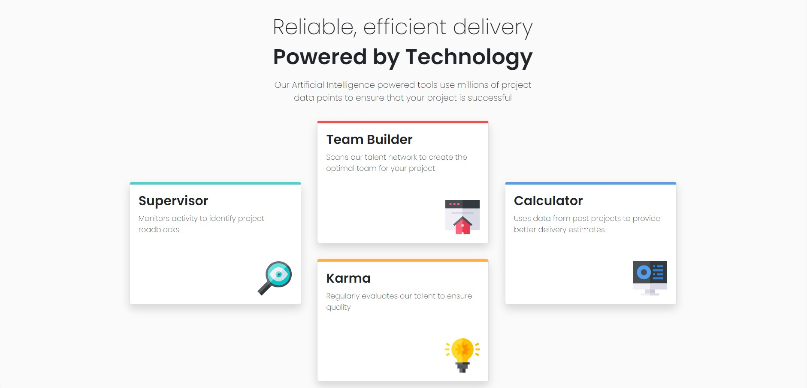

# Frontend Mentor - Four card feature section solution

This is a solution to the [Four card feature section challenge on Frontend Mentor](https://www.frontendmentor.io/challenges/four-card-feature-section-weK1eFYK). Frontend Mentor challenges help you improve your coding skills by building realistic projects. 

## Table of Contents

- [Overview](#overview)
  - [The Challenge](#the-challenge)
  - [Screenshot](#screenshot)
  - [Links](#links)
- [My process](#my-process)
  - [Built With](#built-with)
  - [What I Learned](#what-i-learned)
  - [Continued Development](#continued-development)
  - [Useful Resources](#useful-resources)
- [Acknowledgments](#acknowledgments)

## Overview 

### The Challenge

Users should be able to:

- View the optimal layout for the site depending on their device's screen size
### Screenshot



### Links

- [GitHub Repo URL](https://github.com/adrvnc/four-card-feature-section)
- [Live Site URL](https://adrvnc.github.io/four-card-feature-section/)

## My Process


### Built With 

- HTML 
- CSS
- Bootstrap 5.1.3
### What I Learned 

I became more acquainted with using CSS Flexbox for a more 
responsive layout. 
### Continued Development 
Using the CSS `flex-wrap` property was an essential part of the 
design of my project. I plan to refer back to it when creating 
future projects.

### Useful Resources 

- [CSS flex-wrap property](https://developer.mozilla.org/en-US/docs/Web/CSS/flex-wrap) - This property helped me place the "karma" card on top of the "team builder" card. It's perfect for stacking items on top of each other.
- [TranslateY()](https://developer.mozilla.org/en-US/docs/Web/CSS/transform-function/translateY()) - This function helped me move the "supervisor" card and the "calculator" card down to their current position. Use this to reposition elements vertically.

## Acknowledgements

I want to give a shoutout to UdemeSamuel's [CodeSandbox solution](https://codesandbox.io/s/5g904).
I used the following code to layout all four cards:

```
.page2 {
  display: flex;
  flex-wrap: wrap;
  justify-content: center;
  margin: 0 auto;
  max-width: 1140px;
  align-items: center;
}

``` 
The code was easy to understand and follow. Afterward, I did more
research to have a more in-depth understanding of `flex-wrap`. 
